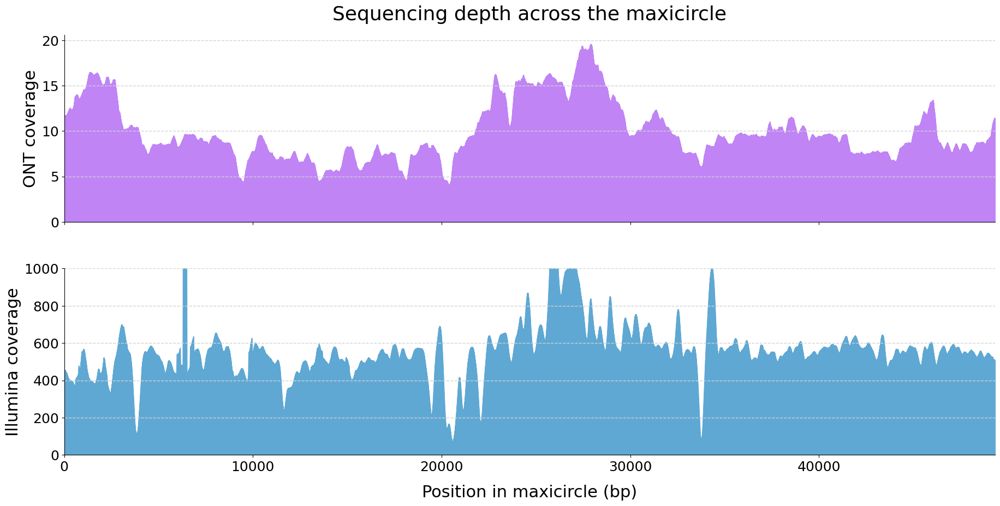

# kDNA-Maxicircle-coverage

Python script for visualizing sequencing depth across a kinetoplast maxicircle DNA, combining ONT (Oxford Nanopore) and Illumina coverage tracks into a single publication-quality figure.

## Example output



## Description

This script generates a two-panel coverage plot from depth-of-coverage files:

- **Top panel (purple):** ONT long-read coverage, smoothed with a 200 bp moving average
- **Bottom panel (blue):** Illumina short-read coverage, smoothed with a 200 bp moving average

Coverage maxima are calculated automatically from the data, so the script adapts to any maxicircle length and any sequencing depth.

## Requirements

- Python 3.7 or higher
- The following Python libraries (installed automatically if missing):
  - `pandas`
  - `matplotlib`
  - `numpy`

## Input files

Two depth-of-coverage files in tabular format (tab-separated, three columns):

```
chromosome    position    depth
```

These can be generated with `samtools depth` or exported from Galaxy.

## Usage

### On your local machine

```bash
python maxicircle_coverage.py
```

The script will ask you to enter the filename for each coverage file:

```
Enter the ONT coverage file (e.g. file.tabular): your_ont_file.tabular
Enter the Illumina coverage file (e.g. file.tabular): your_illumina_file.tabular
```

### On Google Colab

Upload the script and run it. The script will prompt you to upload your coverage files directly from your computer through the Colab interface.

## Output

A high-resolution PNG figure (`maxicircle_coverage_smoothed_guides.png`, 1000 dpi), ready for publication.

## License

This work is licensed under a [Creative Commons Attribution-NonCommercial 4.0 International License](https://creativecommons.org/licenses/by-nc/4.0/).

You are free to use and adapt this script for non-commercial purposes, as long as appropriate credit is given.

## Author

Fanny Rusman — IPE-CONICET, Salta, Argentina  
[](https://orcid.org/0000-0003-3995-9027)
